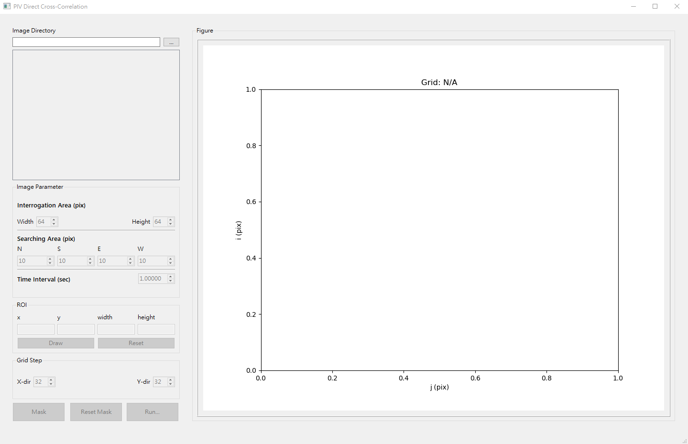
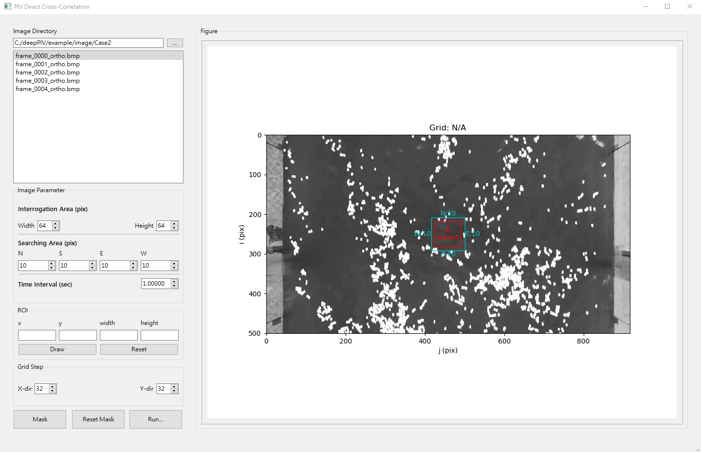
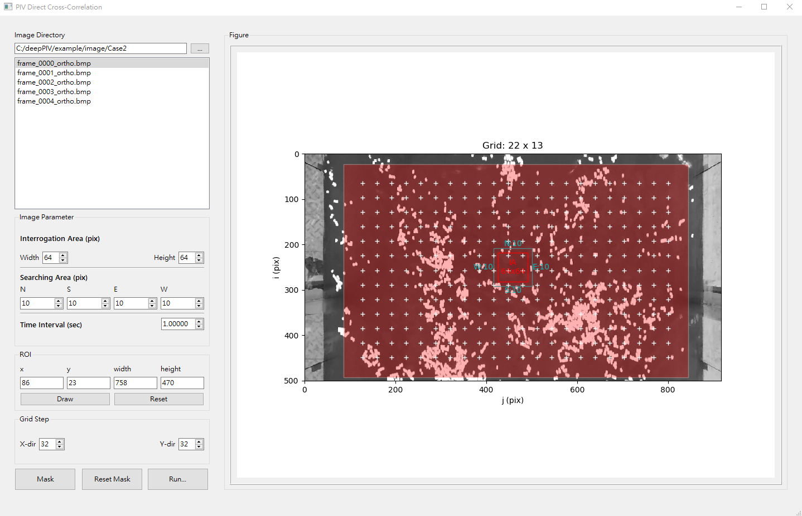
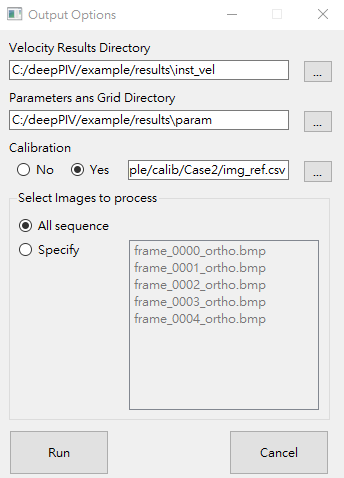
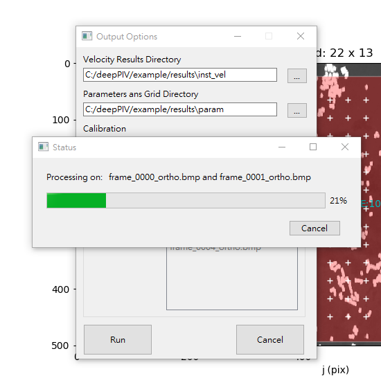
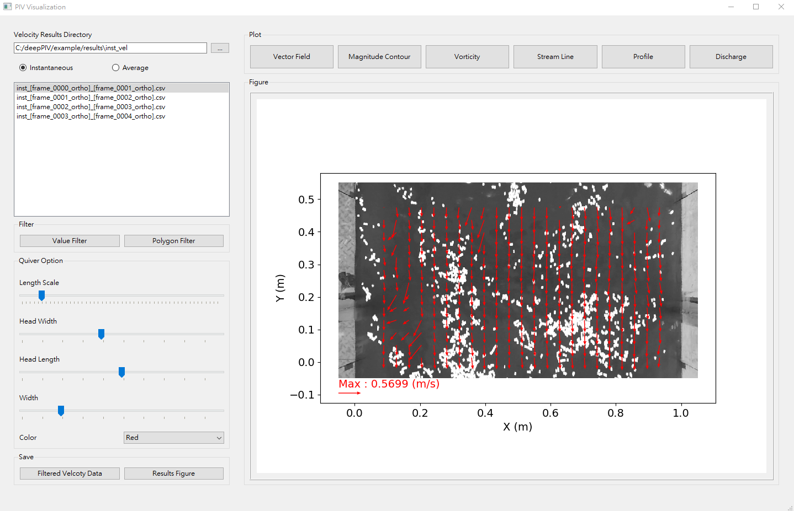

# pyPIV

This is the project dealing with **Particle Image Velocimetry** based on two algorithm:
#### 1. Direct Cross Correlation (DCC)
#### 2. Convolutional Neural Network (CNN)  
  

The GUI files help user to modify the parameters in the algorithm more easily.

**[Note]:** CNN method is not public. If you are interested in this part, I can show it in person.**  

###Interface Overview:  
  

## Packages:
OS: **Windows10**.

Package: Listed in "requirements.txt", just install those packages by <code>pip install -r requirements.txt</code>.

**Note: Only CNN method requires tensorflow-gpu!**

## Simple Tutorial:
### 1. Run the scripts:
To use DCC method:
<code>python PIV_DCC_gui.py</code>

### 2. Browse the images for analyzing:
Clicks the button <code>...</code> to browse the image folder.
For example, select the folder .\example\image\Case2 as the folder.

**[Note]:** You can't have the file which is not the image types ('.bmp', '.tif', '.png', '.jpg', ...) in the folder.

  

### 3. Setting the parameters of images:
#### 3.1 IA and SA
The IA and SA box is the most important parameters which controling the amount of features for matching, and IA should contain the at least 7 particles more for a confidence results.

The SA is the area that expanding from IA. In this area, it will calculate the relationship between IA and the same-size candidate sub-images in SA, and finally return the position of the matched one.

>For example, use (64,64) as IA, (10, 10, 10, 10) as SA in the block "Image Parameter"  
  

>If you choose "PIV_DCC_gui.py" to execute, the matching algorithm will be **Direct Cross-Correlation**;

#### 3.2 Time interval
This will be set as the time interval between each frame
>For example, the term is 0.02 sec only for Case2.  

### 4. Setting the step of grid:
Block "Grid Step" will define the space between the grids.

>For example, use (32,32) as the steps 

### 5. Setting ROI and grid:
Click the button "Draw" in the block "ROI" to star draw a rectangular area for analysis, or you can directly key-in the position and size of ROI.
  

### 6. Run:
Press "Run" button and it will pop up a dialog to let you specify the directory you want to save the results.
>For example, click <code>...</code> and make a new folder: .\example\results

Also, if you want to have the velocity results in the meter per second, you can check the radio buttom on "Yes" on the Calibration block, and select the calibration data by browsing.
>For example, click <code>...</code> then change the direction to .\example\calib\Case2\img_ref.csv  

  

**[Note]:** The calibration data format should be same as the file .\example\calib\Case2\img_ref.csv if you want to used your own data.  
  

Finally, just press `Run` to start analyzing.  
  

### 8. Visualization:
After analysis was done, close the window and then execute the script in terminal:

<code>python Visualization.py</code>

In this GUI program, you can browse the folder you just created for the results of the PIV analysis by clicking `...`, then plot the velocity field, contour, or streamlines with the results in instantaneous or average velocity.

>For example, browse the directory: .\example\results, and try those button in the block "Plot"  

  

  
